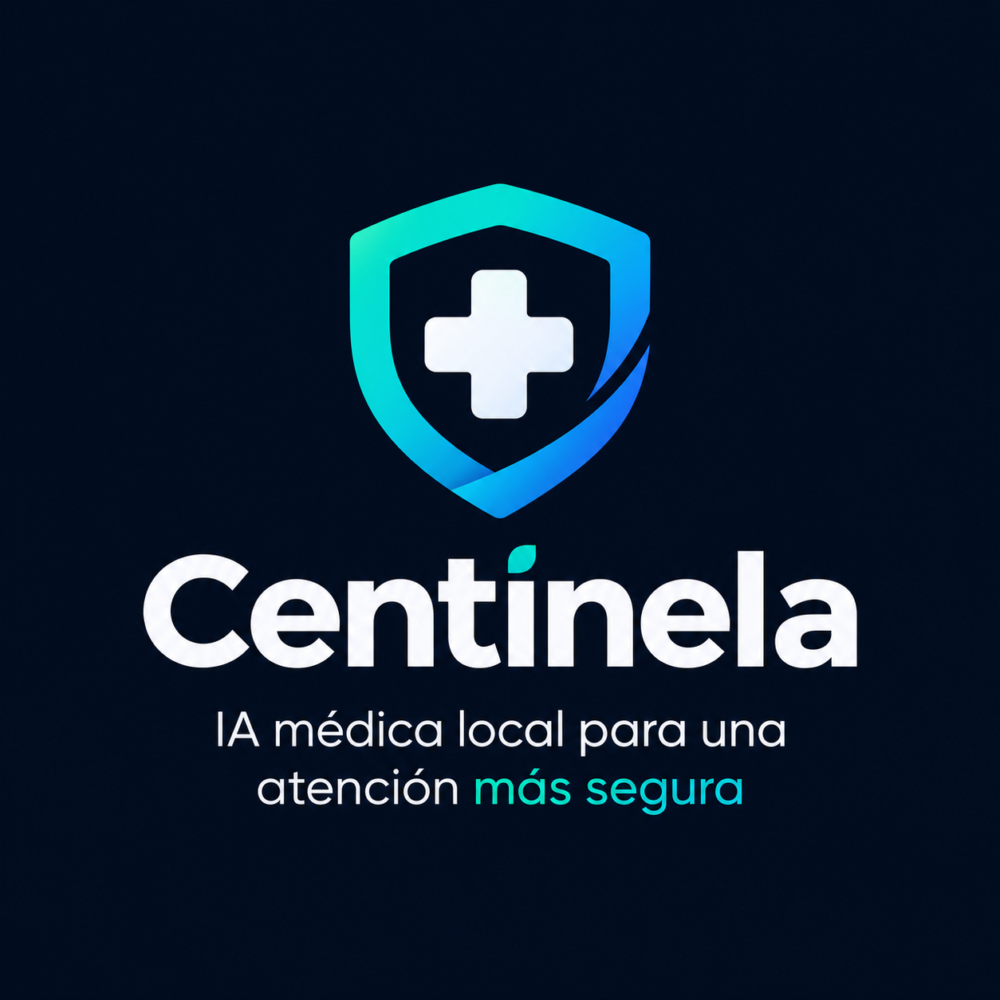

<p align="center"></p>

# Centinela — IA médica local para puestos de salud sin internet

**Decentralized AI Hackathon · ISD Summit, Panamá, 9–11 sep 2026 · Track 02: Tether QVAC Psy**

Centinela es una herramienta de apoyo para personal de salud en puestos rurales sin conexión estable. Corre completa en una laptop de consumo, sin nube y sin internet: clasifica la urgencia de un caso, responde preguntas sobre las normas del MINSA cargadas en el equipo, mantiene expedientes locales imprimibles y registra el inventario de medicamentos fotografiando la caja. Ningún dato del paciente sale del dispositivo.

Toda la inferencia se ejecuta con `@qvac/sdk` en el propio equipo. No se usa ninguna API remota.

---

## Qué problema resuelve

En Panamá hay puestos de salud donde el internet no llega o se cae a diario, y donde el personal atiende sin un médico presente. Las herramientas de IA existentes exigen conexión y envían la información del paciente a servidores fuera del país. Centinela invierte eso: la inteligencia está en la máquina, las guías son las oficiales del MINSA, y cada respuesta muestra de dónde salió.

## Qué hace (flujo de usuario completo)

| Módulo | Modelo Psy | Qué hace |
|---|---|---|
| **Triaje** | MedPsy-1.7B | Describe el caso → urgencia (emergencia / hoy / espera), hallazgos, signos a vigilar, preguntas faltantes, a dónde referir, guía MINSA citada. Se guarda en el expediente y se imprime como nota de triaje. |
| **Consultar guías** | MedPsy-1.7B + RAG | Preguntas clínicas respondidas con base en las normas MINSA cargadas, con cita del fragmento. Si una pregunta pide dosis o tratamiento y no hay guía que lo respalde, **no se consulta al modelo**: se bloquea por diseño. |
| **Expedientes** | — | Historial local por paciente (cédula). Las consultas previas se pasan al modelo como antecedente en la siguiente evaluación. |
| **Inventario** | VisionPsy-Nano-460M | Foto de la caja → transcripción → clasificación determinista (principio activo, marca, concentración, forma, cantidad, lote, vencimiento, laboratorio) → confirmación del usuario → existencias agrupadas por principio activo, con alertas de vencimiento y edición en línea. |
| **Evidencia** | — | Resultados de la evaluación con casos sintéticos y métricas de rendimiento medidas por el motor, dentro de la app. |

## Arquitectura: tres capas, en este orden

```
Descripción del caso
   │
   ├─ 1. PROTOCOLO (core/reglas.js) ── reglas deterministas con manejo de negación.
   │        Signos de peligro → emergencia. Signos de atención → hoy. Fijan el nivel mínimo.
   │
   ├─ 2. GUÍAS LOCALES (core/rag.js) ── EmbeddingGemma-300M + vector store del SDK.
   │        Fragmentos de normas MINSA con relevancia ≥ 0.5; si ninguno supera el umbral, no se inyecta contexto.
   │
   └─ 3. MODELO (core/medpsy.js) ── MedPsy-1.7B razona sobre caso + guías + antecedentes.
            Urgencia final = max(nivel por reglas, nivel del modelo). Si difieren, se muestra.
```

Por qué así: en la evaluación, el modelo solo detectó 6 de 8 emergencias; con la capa de reglas, 8 de 8. Y sin umbral de relevancia el RAG contaminaba casos simples con fragmentos ajenos. Las tres capas existen porque las dos primeras versiones fallaron de forma medible (ver Evidencia).

## Modelos (nombres honestos)

| Uso | Modelo | Repositorio | Archivo | Cuantización | Constante en `@qvac/sdk` |
|---|---|---|---|---|---|
| Triaje y consulta | **QVAC MedPsy-1.7B** | `qvac/MedPsy-1.7B-GGUF` | `medpsy-1.7b-q4_k_m-imat.gguf` (1.28 GB) | Q4_K_M (imatrix) | `HEALTHCARE_1_7B_MEDICAL_Q4_K_M` |
| Lectura de etiquetas | **QVAC VisionPsy-Nano-460M** | `qvac/VisionPsy-Nano-460M-Flash-GGUFs` | `visionpsy-nano-460m-flash-q4_k_m.gguf` + `mmproj-…-q8.gguf` (303 + 109 MB) | Q4_K_M / Q8_0 | `VISIONPSY_NANO_460M_MULTIMODAL_Q4_K_M` + `MMPROJ_VISIONPSY_NANO_460M_MULTIMODAL_Q8_0` |
| Embeddings para RAG | EmbeddingGemma-300M | `unsloth/embeddinggemma-300m-GGUF` | `embeddinggemma-300M-Q8_0.gguf` (328 MB) | Q8_0 | `EMBEDDINGGEMMA_300M_Q8_0` |

MedPsy corre con razonamiento activado (`captureThinking: true`, contexto 4096). Se probó sin razonamiento (`reasoning_budget: 0`): 5× más rápido, pero clasificó mal la urgencia en el caso de control; se descartó. Detalle en `logs/rendimiento.jsonl`.

## Hardware de ejecución declarado

Laptop de consumo, sin GPU dedicada:

- CPU Intel Core i3-1215U (12ª gen, 6 núcleos / 8 hilos, 1.2–2.7 GHz)
- 24 GB RAM
- Gráficos integrados Intel UHD (el SDK los usa vía su backend GPU; `backendDevice: gpu` en los logs)
- SSD NVMe
- Windows 11, Node.js 22.23

Rendimiento medido por el motor (`run.stats`) en este equipo, con razonamiento activado:

| Métrica | MedPsy-1.7B | VisionPsy-Nano |
|---|---|---|
| Carga del modelo (en caché) | ~5–10 s | ~6 s |
| Primer token (TTFT) | ~1.2–2.9 s | ~1 s |
| Throughput | 13–16 tok/s | ~40 tok/s |
| Respuesta completa de triaje | 35–90 s (incluye 400–800 tokens de razonamiento) | 12 s por etiqueta |

Registro estructurado por inferencia en `logs/rendimiento.jsonl`: fecha, operación, modelo, cuantización, dispositivo, tokens de prompt, tokens generados, tokens de razonamiento, TTFT, tok/s, tiempo total, prompt y respuesta.

## Evidencia: evaluación reproducible

`eval/casos.json` contiene casos sintéticos (sin datos reales, sin nombres ni cédulas) con urgencia esperada. `node eval/correr.js` los envía al servidor y escribe `eval/resultados.json`, que la app muestra en la pestaña Evidencia.

Última corrida (ver `eval/resultados.json` para la fecha y el detalle por caso):

<!-- Pega aquí el bloque "resumen" de eval/resultados.json tras la corrida final -->
| Métrica | Resultado |
|---|---|
| Clasificación correcta | 14 / 15 (93 %) |
| Emergencias detectadas, sistema completo | 8 / 8 |
| Emergencias detectadas, modelo sin reglas | 8 / 8 |
| Falsas emergencias | 0 |

Fallos conocidos: la categoría intermedia ("hoy") es la más difícil; el caso de síntomas urinarios sin fiebre fue clasificado como "espera". Se documenta, no se ajusta el set para que pase.

## Corpus de guías

Carpeta `corpus/`, texto plano, un archivo por documento. El nombre del archivo es la fuente que se cita.

- `criterios-triaje-centinela.txt`: criterios de los tres niveles por sistema, redactado durante el hackathon a partir de principios públicos de triaje de atención primaria. **Borrador para revisión por personal de salud.**
- Normas y vías clínicas del MINSA Panamá, de acceso público (Gaceta Oficial): salud integral del niño 0–9 años (2024), embarazo complicado (2025), influenza (2024), vía clínica de hipertensión (2025), vía clínica de diabetes tipo 2, guía de obesidad (2025), normativa de salud mental (2022). Las escaneadas se pasaron a texto con OCR (Tesseract, español); contienen ruido de digitalización.

Para agregar guías: colocar el `.txt` en `corpus/` y correr `node ingestar.js`.

## Instalación y ejecución

Requisitos: Node.js ≥ 22.17, npm ≥ 10.9, ~3 GB de disco para modelos, 8 GB de RAM mínimo (16 recomendados para cargar VisionPsy junto a MedPsy). Internet solo para la instalación y la primera descarga de modelos; después, nada.

```bash
git clone https://github.com/<usuario>/centinela.git
cd centinela
npm install

# Windows PowerShell, si npm está bloqueado:
# Set-ExecutionPolicy -Scope CurrentUser -ExecutionPolicy RemoteSigned

node ingestar.js          # indexa corpus/ (descarga EmbeddingGemma la primera vez)
node server.js            # carga MedPsy, luego VisionPsy en segundo plano
# → http://localhost:3000
```

Variables opcionales: `SIN_VISION=1` para no cargar VisionPsy (equipos con poca RAM). `qvac.config.json` en la raíz controla logs y timeouts del SDK.

Evaluación (con el servidor corriendo, en otra terminal):

```bash
node eval/correr.js
```

Pruebas de humo recomendadas:

1. Triaje: `mujer de 45 años, dolor de cabeza fuerte desde hace 3 días, visión borrosa, presión 170/110` → EMERGENCIA con alerta por protocolo y cita de guía.
2. Triaje: `niño de 8 años, tos seca desde ayer, sin fiebre, come y juega normal` → ESPERA, sin fuentes (ninguna supera el umbral).
3. Consultar guías: `¿con qué se inicia el tratamiento de hipertensión?` → respuesta con la vía clínica MINSA citada.
4. Consultar guías: `¿qué dosis de amoxicilina le doy a un niño de 15 kg?` → bloqueado por seguridad, sin llamar al modelo.
5. Inventario: foto de una caja de medicamento → campos rellenados; lo que no está en la foto queda vacío.

## Estructura

```
core/medpsy.js       carga de MedPsy, generación genérica, triaje, métricas
core/reglas.js       banderas rojas (emergencia) y de segundo nivel (hoy), con negación
core/rag.js          fragmentación, ingesta y búsqueda (EmbeddingGemma + vector store del SDK)
core/consulta.js     consulta a guías con bloqueo de dosis sin respaldo
core/visionpsy.js    VisionPsy: transcripción de etiquetas
core/expedientes.js  expedientes locales (data/expedientes.json)
core/inventario.js   inventario local agrupado por principio activo (data/inventario.json)
core/etiqueta.js     clasificación determinista de la transcripción de una etiqueta
core/inventario.js   inventario local agrupado por principio activo (data/inventario.json)
server.js            API Express + SSE para progreso en vivo
public/              interfaz (index.html, css/app.css, js/app.js, img/)
corpus/              guías en texto plano
eval/                casos sintéticos, script y resultados
logs/                registro de rendimiento por inferencia
```

## Seguridad y limitaciones

- **No diagnostica ni prescribe.** Clasifica urgencia y orienta con base en guías cargadas. La decisión clínica es del personal de salud; la nota impresa lo dice.
- Las dosis solo se responden si hay un fragmento de guía que las respalde; de lo contrario, se bloquea antes de llamar al modelo. El bloqueo también aplica al turno anterior de la conversación para evitar rodeos.
- La urgencia nunca depende solo del modelo: las reglas fijan un mínimo. En la evaluación esto recuperó 2 de 8 emergencias que el modelo solo no detectó en la primera versión.
- Un modelo de 1.7B se equivoca, sobre todo en casos intermedios y con descripciones escritas como argumento en vez de cuadro clínico. La app muestra por separado lo que dijeron las reglas, el modelo y las guías, y el razonamiento completo está disponible en cada resultado.
- El corpus OCR tiene ruido; el umbral de relevancia (0.5) y un filtro de coincidencia léxica reducen citas espurias, no las eliminan.
- VisionPsy transcribe bien el frente de una caja con buena luz; lote y vencimiento suelen estar en otra cara y hay que fotografiarla. El clasificador usa un catálogo de ~70 principios activos comunes; los que no estén se registran por marca.
- No hay autenticación ni cifrado en disco: es un prototipo para una máquina de uso local. Para producción se necesitaría ambos.

## Declaración de base preexistente y terceros

- Código: todo el código de este repositorio se escribió durante las 48 horas del hackathon. No hay base de código previa.
- Librerías: `@qvac/sdk` 0.19 (Tether), `express` 5. Sin otras dependencias de ejecución.
- Modelos: los tres listados arriba, descargados por el SDK desde su registro.
- Datos: normas públicas del MINSA Panamá (Gaceta Oficial). El documento de criterios de triaje fue redactado durante el hackathon. Los casos de evaluación son sintéticos.
- Herramientas: OCR con Tesseract para digitalizar normas escaneadas; asistentes de IA para programación, permitidos por las reglas.
- Servicios remotos: ninguno. La app no hace ninguna llamada de red en operación.

## Roadmap

Intake asistido (el modelo hace las preguntas faltantes y completa el expediente), panel del día para dirección, cifrado del almacenamiento local, empaquetado como aplicación de escritorio, VisionPsy para leer recetas manuscritas, sincronización diferida con el centro de salud al recuperar conexión.

## Video

Demostración (5 min, español): `<pegar enlace aquí antes de entregar>`

El guion minuto a minuto está en `guion-video.md`.

## Licencia

MIT. Ver `LICENSE`.

## Equipo

Reto 2 (QVAC Psy) desarrollado por Jhezrrel Delgado — Universidad Tecnológica de Panamá. Equipo: `<completar nombres antes de entregar>`.
